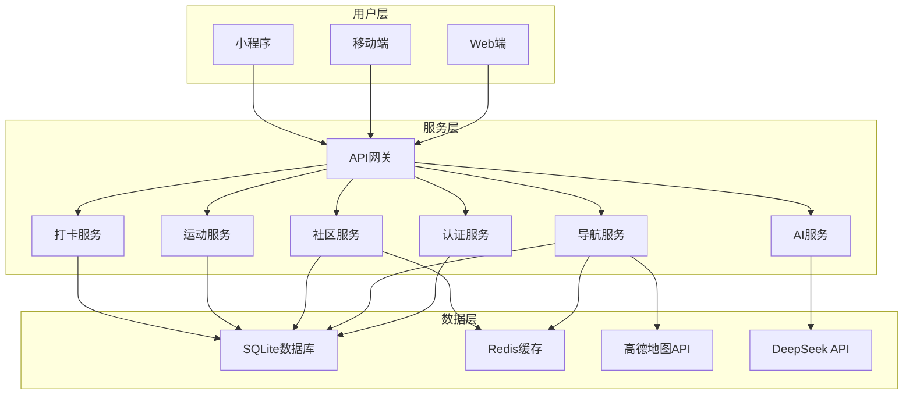
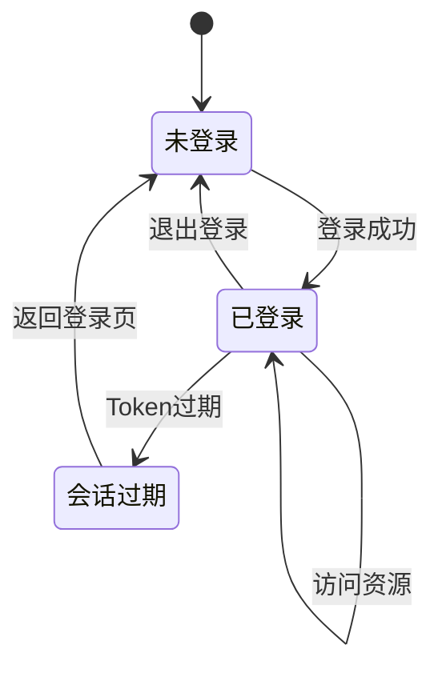
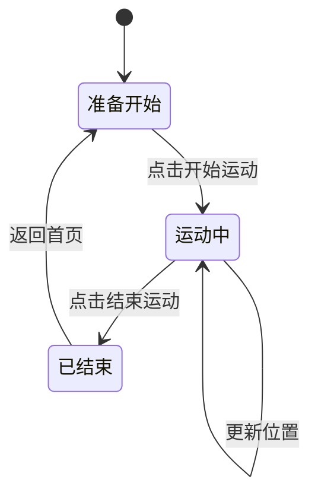
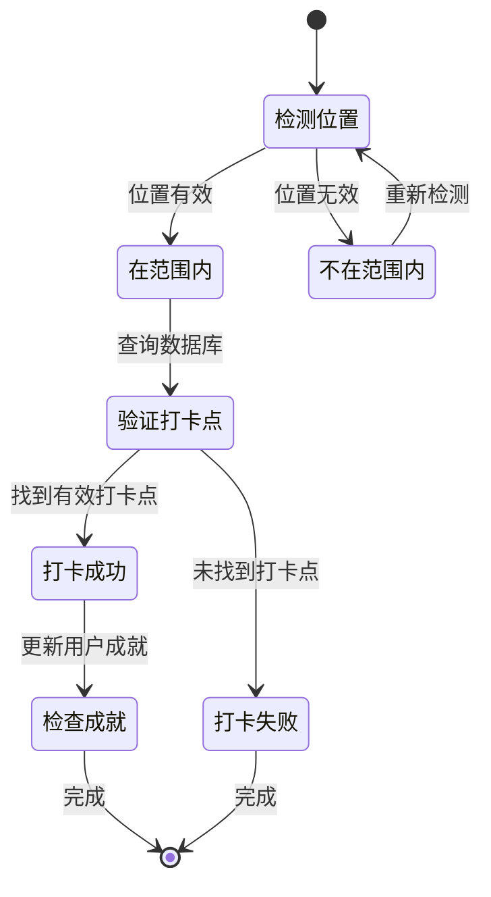
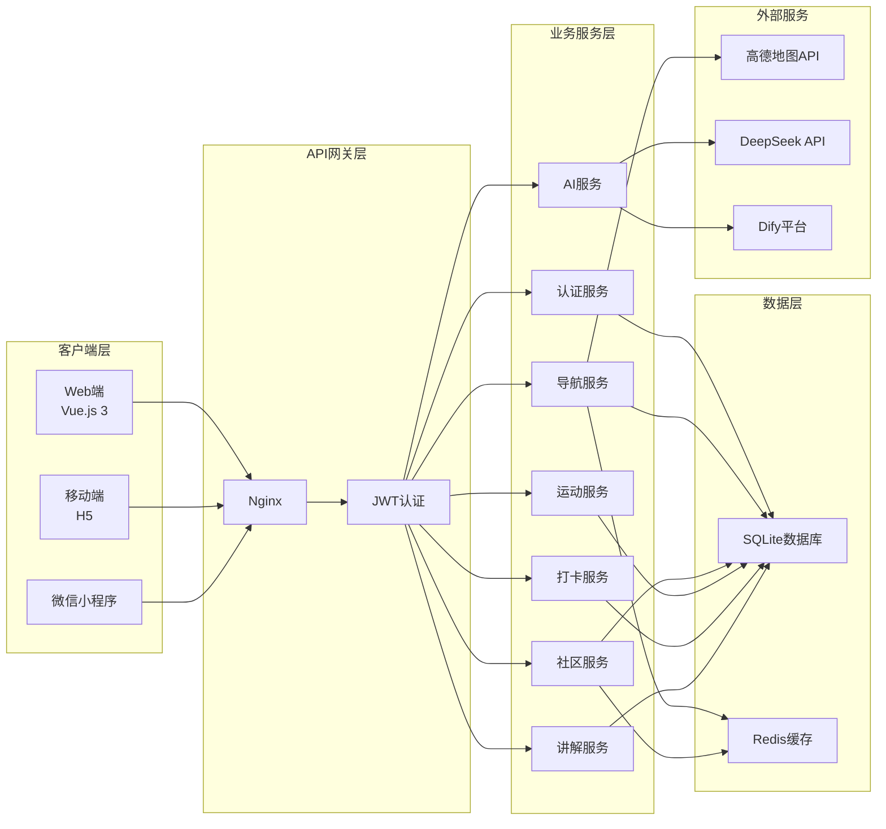

# 武理导航系统 - 数据库设计与可视化图表

---

## 一、数据库设计

### 1.1 索引优化

**索引设计**:
| 表名 | 字段 | 索引类型 | 说明 |
|------|------|----------|------|
| users | email | UNIQUE | 加速登录查询 |
| users | username | UNIQUE | 加速用户名查询 |
| workouts | user_id | INDEX | 加速用户运动记录查询 |
| workouts | start_time | INDEX | 加速时间范围查询 |
| posts | user_id | INDEX | 加速用户帖子查询 |
| posts | created_at | INDEX | 加速按时间排序 |
| checkins | user_id | INDEX | 加速用户打卡查询 |
| checkins | place_id | INDEX | 加速地点打卡统计 |
| places | category | INDEX | 加速分类查询 |
| places | is_checkpoint | INDEX | 加速打卡点筛选 |

**索引创建SQL**:
```sql
CREATE UNIQUE INDEX idx_users_email ON users(email);
CREATE UNIQUE INDEX idx_users_username ON users(username);

CREATE INDEX idx_workouts_user_id ON workouts(user_id);
CREATE INDEX idx_workouts_start_time ON workouts(start_time);

CREATE INDEX idx_posts_user_id ON posts(user_id);
CREATE INDEX idx_posts_created_at ON posts(created_at);

CREATE INDEX idx_checkins_user_id ON checkins(user_id);
CREATE INDEX idx_checkins_place_id ON checkins(place_id);

CREATE INDEX idx_places_category ON places(category);
CREATE INDEX idx_places_is_checkpoint ON places(is_checkpoint);
```

### 1.2 数据迁移策略

**迁移步骤**:
1. 备份数据：迁移前执行完整数据库备份
2. 创建新表：创建新结构的表
3. 数据迁移：编写迁移脚本迁移数据
4. 验证数据：验证迁移后数据完整性
5. 切换服务：停服切换到新表
6. 监控运行：上线后监控运行状态

**迁移工具**:
- 使用 alembic 进行数据库迁移管理
- 编写版本化迁移脚本
- 支持回滚操作

### 1.3 数据库备份与恢复

**备份策略**:
| 类型 | 频率 | 保留期 | 存储位置 |
|------|------|--------|----------|
| 每日全量备份 | 每天凌晨2点 | 7天 | 本地 + 云端 |
| 每周增量备份 | 每周日 | 30天 | 云端 |
| 手动备份 | 按需 | 永久 | 本地 |

**备份命令**:
```bash
sqlite3 wut_auth.db ".backup backup/wut_auth_$(date +%Y%m%d).db"
```

**恢复命令**:
```bash
sqlite3 wut_auth.db ".restore backup/wut_auth_20260622.db"
```

---

## 二、可视化架构图

### 2.1 数据流图



### 2.2 用户认证状态图



### 2.3 运动记录状态图



### 2.4 打卡流程状态图



### 2.5 完整系统架构图



---

**文档版本**: v1.0  
**创建日期**: 2026年6月22日  
**适用项目**: 武汉理工大学智能导航系统