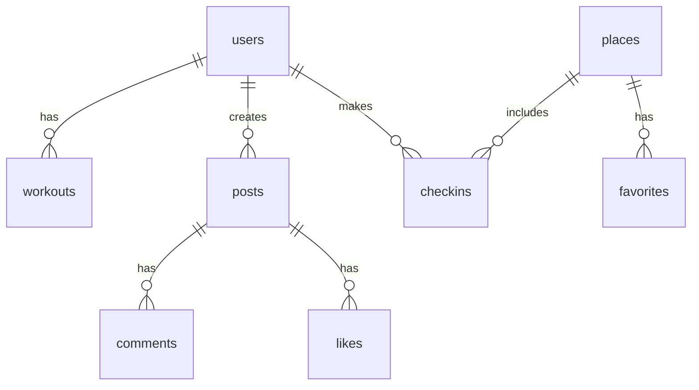
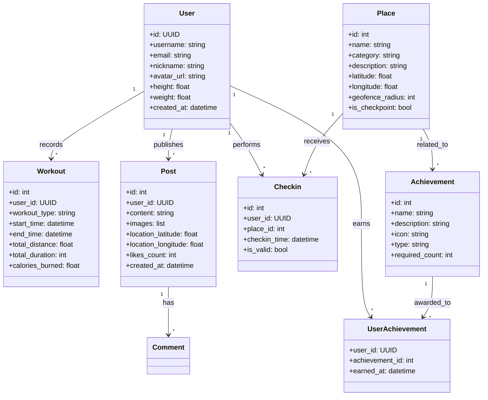
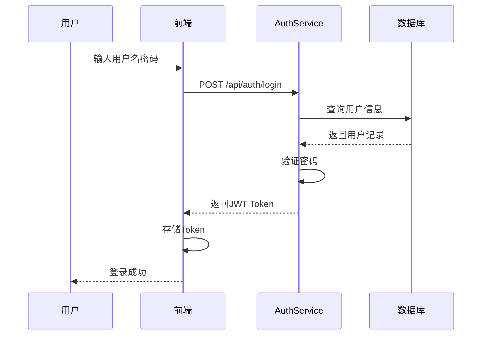
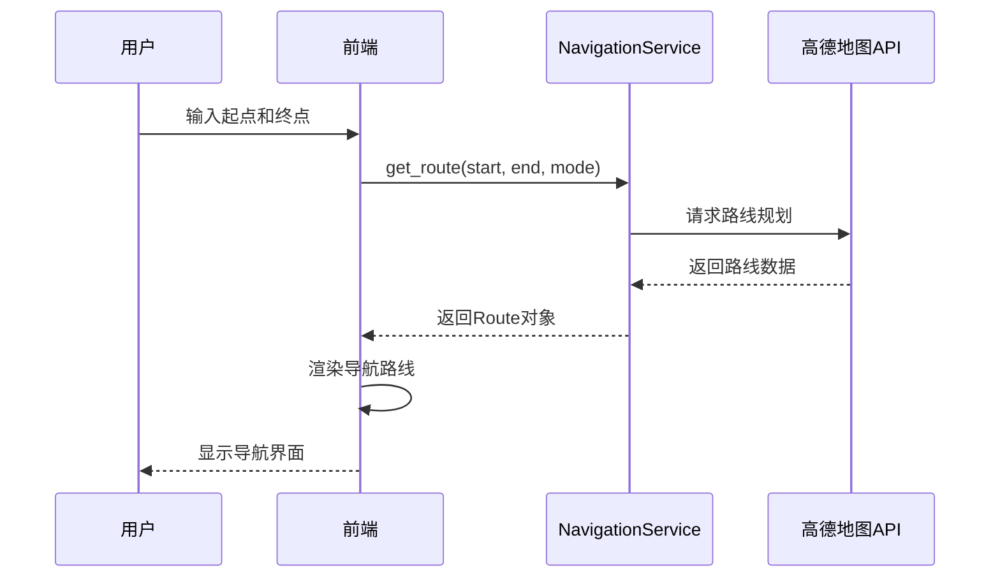
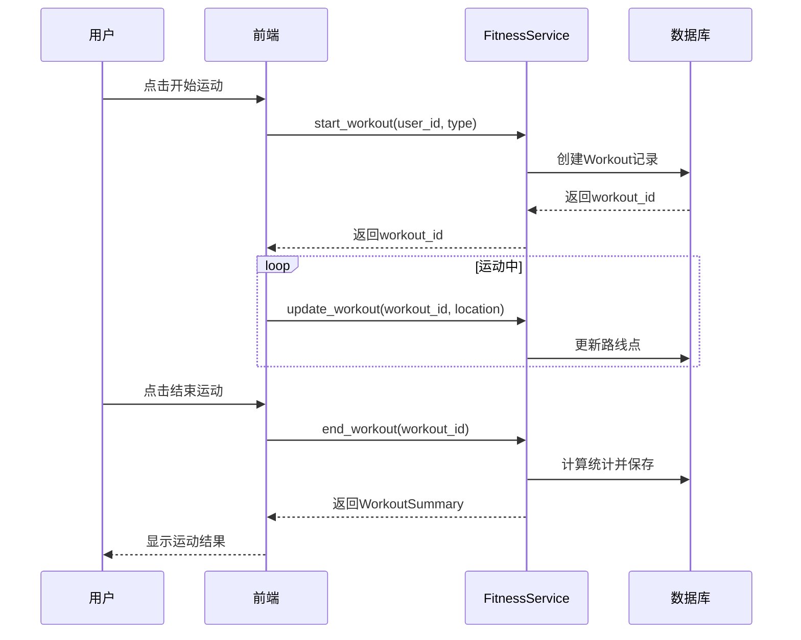
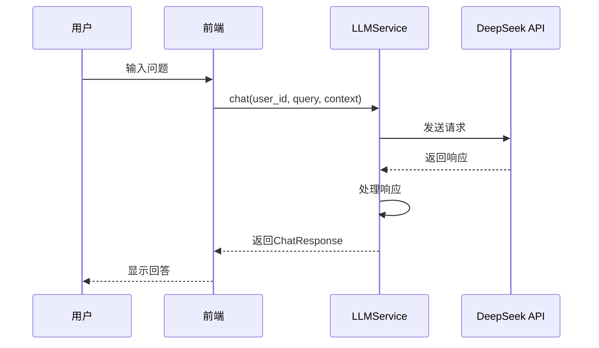

# 武理导航系统 - 完整设计文档

---

## 一、可行性分析

### 1.1 业务可行性

**项目名称**: 武汉理工大学智能导航系统  
**目标场景**: 校园导航与社交平台，为师生提供定位、导航、景点讲解、运动健康等服务

**核心功能价值**:
| 功能模块 | 业务价值 | 用户群体 |
|----------|----------|----------|
| 🗺️ 定位导航 | 解决校园迷路问题，提升出行效率 | 全体师生、访客 |
| 🤖 智能聊天 | 自然语言交互，获取校内信息 | 全体师生 |
| 📖 景点讲解 | 文化传承，提升校园体验 | 新生、访客 |
| 🏃 运动健康 | 记录运动数据，促进健康生活 | 学生、教职工 |
| 📱 校内社区 | 社交分享，增强校园凝聚力 | 学生群体 |
| 📸 游览打卡 | 游戏化打卡，增加校园活动参与 | 学生群体 |

**市场定位**: 
- **目标用户**: 武汉理工大学师生（约5万人）
- **差异化优势**: 深度整合校园场景，提供个性化服务
- **扩展性**: 可扩展至其他高校

**业务指标**:
- 日活跃用户目标: 5000+
- 导航准确率: 95%以上
- 用户满意度: 4.5/5

### 1.2 技术可行性

**技术栈适配性**:
| 技术 | 版本 | 适配说明 |
|------|------|----------|
| **FastAPI** | 0.104+ | 高性能异步框架，支持快速开发 |
| **SQLAlchemy** | 2.0+ | 成熟ORM，支持多种数据库 |
| **高德地图API** | 最新 | 高精度地图服务，支持校园定位 |
| **DeepSeek API** | 最新 | AI大模型支持，智能问答 |
| **JWT** | 最新 | 安全的身份认证机制 |

**Agent框架集成**:

### 1.2.1 Dify平台集成方案

**集成架构**:
```
┌─────────────────────────────────────────────────────────────┐
│                    武理导航系统                             │
│  ┌─────────────────────────────────────────────────────┐   │
│  │                   LLMService                        │   │
│  │  ┌──────────────┐  ┌────────────────────────────┐  │   │
│  │  │  DifyClient  │──│ 本地知识库 + 场景规则引擎   │  │   │
│  │  └──────┬───────┘  └────────────────────────────┘  │   │
│  └─────────┼──────────────────────────────────────────┘   │
│            │                                              │
└────────────┼──────────────────────────────────────────────┘
             │ HTTP API
             ▼
┌─────────────────────────────────────────────────────────────┐
│                      Dify平台                              │
│  ┌──────────────┐  ┌──────────────┐  ┌──────────────┐    │
│  │  对话流程   │  │   知识库     │  │   工具调用   │    │
│  │   编排器    │  │   管理模块   │  │   模块      │    │
│  └──────────────┘  └──────────────┘  └──────────────┘    │
└─────────────────────────────────────────────────────────────┘
```

**Dify配置**:
| 配置项 | 值 | 说明 |
|--------|------|------|
| API密钥 | DIFY_API_KEY | 从Dify平台获取 |
| 应用ID | DIFY_APP_ID | 智能助手应用ID |
| 环境 | production | 生产环境 |

**集成接口**:
```python
# app/dify_service.py
class DifyService:
    def __init__(self):
        self.base_url = "https://api.dify.ai/v1"
        self.api_key = os.getenv("DIFY_API_KEY")
    
    async def chat(self, user_id: str, message: str) -> dict:
        """调用Dify聊天接口"""
        headers = {"Authorization": f"Bearer {self.api_key}"}
        data = {
            "inputs": {},
            "query": message,
            "response_mode": "streaming",
            "user": user_id
        }
        async with httpx.AsyncClient() as client:
            response = await client.post(
                f"{self.base_url}/chat-messages",
                headers=headers,
                json=data
            )
            return response.json()
    
    async def add_knowledge(self, content: str) -> bool:
        """添加知识库内容"""
        # 实现知识库文档上传
        pass
```

**Agent工作流设计**:
1. **用户提问** → LLMService → Dify API
2. **意图识别** → 判断是否需要调用工具
3. **工具调用** → 导航、打卡、运动等服务
4. **结果汇总** → 返回自然语言回复

### 1.2.2 场景规则引擎

**规则示例**:
| 用户问题 | 触发动作 | 返回结果 |
|----------|----------|----------|
| "去图书馆怎么走" | 调用导航API | 返回路线规划 |
| "附近有什么景点" | 查询景点数据库 | 返回景点列表 |
| "今天天气怎么样" | 调用天气API | 返回天气信息 |

### 1.2.3 知识库管理

**知识库结构**:
- 校园地图数据
- 教学楼信息
- 食堂位置与营业时间
- 校园活动信息
- FAQ常见问题

**更新策略**:
- 每日自动同步
- 手动更新触发
- 版本控制管理

**技术风险评估**:
| 风险点 | 风险等级 | 应对方案 |
|--------|----------|----------|
| 定位精度 | 中 | 融合GPS+WiFi+蓝牙定位 |
| 并发访问 | 中 | 使用Redis缓存热点数据 |
| 大模型成本 | 低 | 合理控制API调用频率 |

### 1.3 运营可行性

**部署方案**:
| 环境 | 配置 | 成本估算 |
|------|------|----------|
| 开发环境 | 本地运行 | 免费 |
| 测试环境 | Docker容器 | ¥200/月 |
| 生产环境 | 云服务器 | ¥800-1500/月 |

**运维策略**:
- 自动化部署（CI/CD）
- 实时监控告警
- 每日数据备份
- 安全审计日志

**推广策略**:
- 开学季集中推广
- 与校园活动结合
- 学生社团合作

---

## 二、物理模型设计

### 2.1 系统架构

```
┌─────────────────────────────────────────────────────────────────┐
│                        客户端层                                 │
│  ┌──────────────┐  ┌──────────────┐  ┌──────────────┐        │
│  │   Web端     │  │   移动端     │  │   小程序     │        │
│  │ (Vue.js 3)  │  │   (H5)       │  │   (微信)     │        │
│  └──────┬───────┘  └──────┬───────┘  └──────┬───────┘        │
└─────────┼──────────────────┼──────────────────┼──────────────────┘
          │                  │                  │
┌─────────┴──────────────────┴──────────────────┴──────────────────┐
│                        API网关层                                │
│                    Nginx + JWT认证                              │
└─────────────────────────────┬───────────────────────────────┘
                              │
        ┌───────────────────────┼───────────────────────┐
        │                       │                       │
┌───────▼───────┐    ┌──────────────┐    ┌──────────────┐
│  认证服务    │    │  LLM服务    │    │  社区服务   │
│ (AuthService)│    │(LLMService) │    │(Community)  │
└───────┬───────┘    └───────┬───────┘    └───────┬───────┘
        │                       │                       │
┌───────▼───────┐    ┌───────▼───────┐    ┌───────▼───────┐
│  定位导航    │    │  景点讲解    │    │  运动健康    │
│(Navigation)  │    │  (Guide)     │    │ (Fitness)    │
└───────┬───────┘    └───────┬───────┘    └───────┬───────┘
        │                       │                       │
        └───────────────────────┼───────────────────────┘
                                │
                    ┌───────────▼───────────┐
                    │    SQLite数据库       │
                    │  (wut_auth.db)       │
                    └───────────────────────┘
```

### 2.2 核心模块交互

#### 用户认证流程
```
用户 → 登录请求 → AuthService → 验证用户 → 返回Token → 前端存储Token
```

#### 导航流程
```
用户 → 输入起点终点 → NavigationService → 高德地图API → 返回路线 → 渲染导航
```

#### AI聊天流程
```
用户 → 发送消息 → LLMService → DeepSeek API → 返回回复 → 前端展示
```

#### 运动记录流程
```
用户 → 开始运动 → FitnessService → 创建记录 → 实时更新位置 → 结束运动 → 保存统计
```

### 2.3 数据流转链路

| 数据类型 | 来源 | 处理 | 存储 |
|----------|------|------|------|
| 用户数据 | 注册/登录 | AuthService验证 | users表 |
| 位置数据 | GPS/网络 | NavigationService解析 | 实时处理 |
| 运动数据 | 传感器 | FitnessService计算 | workouts表 |
| 社交数据 | 用户输入 | CommunityService处理 | posts表 |
| 打卡数据 | 位置检测 | CheckinService验证 | checkins表 |

### 2.4 数据库连接设计

**数据库配置**:
```python
# app/auth_service.py
DATABASE_URL = "sqlite:///./wut_auth.db"

engine = create_engine(
    DATABASE_URL,
    connect_args={"check_same_thread": False}
)

SessionLocal = sessionmaker(autocommit=False, autoflush=False, bind=engine)
```

**数据库表关系**:


---

## 三、域对象抽象设计

### 3.1 核心领域实体

#### User（用户）
- **职责**: 系统的使用者，拥有个人资料和行为记录
- **属性**: id, username, email, nickname, avatar_url, height, weight
- **行为**: 登录、注册、修改资料

#### Place（景点）
- **职责**: 校园内的地点/景点
- **属性**: id, name, category, description, latitude, longitude, geofence_radius
- **行为**: 被搜索、被导航、被讲解

#### Workout（运动记录）
- **职责**: 用户的运动轨迹和统计
- **属性**: id, user_id, workout_type, start_time, end_time, total_distance, calories_burned
- **行为**: 开始、更新、结束、统计

#### Post（帖子）
- **职责**: 用户发布的社交内容
- **属性**: id, user_id, content, images, location_latitude, location_longitude
- **行为**: 创建、点赞、评论

#### Checkin（打卡）
- **职责**: 用户在景点的打卡记录
- **属性**: id, user_id, place_id, checkin_time, location_latitude, location_longitude
- **行为**: 打卡验证、获取历史

#### Achievement（成就）
- **职责**: 用户获得的成就徽章
- **属性**: id, name, description, icon, type, required_count
- **行为**: 解锁、展示

### 3.2 域对象关系图



### 3.3 聚合与组合关系

| 关系类型 | 实体对 | 说明 |
|----------|--------|------|
| **聚合** | User → Workout | 用户拥有运动记录，记录可独立存在 |
| **聚合** | User → Post | 用户发布帖子，帖子可独立存在 |
| **聚合** | User → Checkin | 用户进行打卡，打卡可独立存在 |
| **组合** | User → UserAchievement | 用户获得成就，成就关联不能脱离用户 |
| **关联** | Place → Checkin | 景点被打卡 |
| **关联** | Place → Achievement | 景点关联成就 |
| **组合** | Post → Comment | 帖子包含评论 |
| **组合** | Post → Like | 帖子包含点赞 |

### 3.4 值对象

#### Location（位置）
- **用途**: 表示地理位置坐标
- **属性**: latitude, longitude
- **不可变性**: 坐标值不可修改

#### RoutePoint（路线点）
- **用途**: 导航路线上的一个点
- **属性**: latitude, longitude, timestamp, speed
- **不可变性**: 记录后不可修改

#### Message（消息）
- **用途**: 聊天消息内容
- **属性**: content, sender, timestamp
- **不可变性**: 发送后不可修改

### 3.5 领域服务

#### AuthService（认证服务）
- **职责**: 用户身份验证和授权
- **接口**: register(), login(), get_profile(), update_profile()

#### NavigationService（导航服务）
- **职责**: 路线规划和导航
- **接口**: get_route(), search_place(), get_navigation_steps()

#### GuideService（讲解服务）
- **职责**: 景点讲解和电子围栏
- **接口**: check_proximity(), get_guide(), favorite_place()

#### FitnessService（运动服务）
- **职责**: 运动记录和统计
- **接口**: start_workout(), update_workout(), end_workout(), get_stats()

#### CommunityService（社区服务）
- **职责**: 社交互动
- **接口**: create_post(), like_post(), comment_post(), get_feed()

#### CheckinService（打卡服务）
- **职责**: 打卡和成就
- **接口**: checkin(), get_history(), get_achievements(), generate_poster()

---

## 四、核心业务流程

### 4.1 用户登录流程



### 4.2 导航流程



### 4.3 运动记录流程



### 4.4 智能聊天流程



---

## 五、接口契约

### 5.1 认证接口

#### POST /api/auth/register
**功能**: 用户注册

**请求体**:
```json
{
  "username": "string (必填, 3-50字符)",
  "email": "string (必填, 邮箱格式)",
  "password": "string (必填, 6-100字符)"
}
```

**成功响应** (200 OK):
```json
{
  "success": true,
  "message": "注册成功",
  "data": {
    "id": "uuid-string",
    "username": "testuser",
    "email": "test@example.com",
    "nickname": null,
    "avatar_url": null,
    "registered_at": "2026-06-22T10:30:00"
  }
}
```

**失败响应** (400 Bad Request):
```json
{
  "success": false,
  "message": "用户名已存在"
}
```

#### POST /api/auth/login
**功能**: 用户登录

**请求体**:
```json
{
  "email": "string (必填)",
  "password": "string (必填)"
}
```

**成功响应** (200 OK):
```json
{
  "success": true,
  "message": "登录成功",
  "data": {
    "access_token": "jwt-token-string",
    "token_type": "bearer",
    "user": {
      "id": "uuid-string",
      "username": "testuser",
      "email": "test@example.com",
      "nickname": "Test"
    }
  }
}
```

**失败响应** (401 Unauthorized):
```json
{
  "success": false,
  "message": "邮箱或密码错误"
}
```

#### GET /api/auth/profile
**功能**: 获取用户信息

**请求头**:
```
Authorization: Bearer <access_token>
```

**成功响应** (200 OK):
```json
{
  "success": true,
  "data": {
    "id": "uuid-string",
    "username": "testuser",
    "email": "test@example.com",
    "nickname": "Test",
    "avatar_url": "https://example.com/avatar.jpg",
    "height": 175.0,
    "weight": 65.0,
    "registered_at": "2026-06-22T10:30:00"
  }
}
```

#### PUT /api/auth/profile
**功能**: 更新用户信息

**请求头**:
```
Authorization: Bearer <access_token>
```

**请求体**:
```json
{
  "nickname": "string (可选)",
  "avatar_url": "string (可选)",
  "height": "number (可选)",
  "weight": "number (可选)"
}
```

### 5.2 导航接口

#### GET /api/navigation/route
**功能**: 获取导航路线

**请求参数**:
| 参数 | 类型 | 必填 | 说明 |
|------|------|------|------|
| start_lat | float | 是 | 起点纬度 |
| start_lng | float | 是 | 起点经度 |
| end_lat | float | 是 | 终点纬度 |
| end_lng | float | 是 | 终点经度 |
| mode | string | 否 | 导航模式: walking(默认)/biking/driving |

**成功响应** (200 OK):
```json
{
  "success": true,
  "data": {
    "distance": 500.0,
    "duration": 300,
    "mode": "walking",
    "steps": [
      {"instruction": "向南走100米", "distance": 100},
      {"instruction": "右转进入XX路", "distance": 200}
    ],
    "polyline": "encoded-polyline-string"
  }
}
```

#### GET /api/navigation/search
**功能**: 搜索地点

**请求参数**:
| 参数 | 类型 | 必填 | 说明 |
|------|------|------|------|
| query | string | 是 | 搜索关键词 |
| limit | int | 否 | 返回数量(默认10) |

**成功响应** (200 OK):
```json
{
  "success": true,
  "data": [
    {
      "id": 1,
      "name": "图书馆",
      "category": "building",
      "description": "学校主图书馆",
      "latitude": 30.5075,
      "longitude": 114.3795,
      "is_checkpoint": true
    }
  ]
}
```

### 5.3 运动接口

#### POST /api/fitness/start
**功能**: 开始运动

**请求头**:
```
Authorization: Bearer <access_token>
```

**请求体**:
```json
{
  "workout_type": "string (必填, walking/running/biking)",
  "start_latitude": "float (必填)",
  "start_longitude": "float (必填)"
}
```

**成功响应** (200 OK):
```json
{
  "success": true,
  "message": "运动已开始",
  "data": {
    "workout_id": 123,
    "workout_type": "walking",
    "start_time": "2026-06-22T14:00:00"
  }
}
```

#### POST /api/fitness/end
**功能**: 结束运动

**请求头**:
```
Authorization: Bearer <access_token>
```

**请求体**:
```json
{
  "workout_id": "int (必填)",
  "distance": "float (必填, 单位:米)",
  "duration": "int (必填, 单位:秒)",
  "calories": "float (必填, 单位:卡路里)"
}
```

**成功响应** (200 OK):
```json
{
  "success": true,
  "message": "运动已结束",
  "data": {
    "workout_id": 123,
    "total_distance": 500.0,
    "total_duration": 300,
    "calories_burned": 50.0,
    "avg_speed": 1.67
  }
}
```

#### GET /api/fitness/statistics
**功能**: 获取运动统计

**请求头**:
```
Authorization: Bearer <access_token>
```

**请求参数**:
| 参数 | 类型 | 必填 | 说明 |
|------|------|------|------|
| period | string | 否 | week/month/all (默认week) |

**成功响应** (200 OK):
```json
{
  "success": true,
  "data": {
    "weekly_distance": 5000.0,
    "weekly_calories": 500.0,
    "weekly_count": 5,
    "total_distance": 50000.0,
    "total_calories": 5000.0,
    "total_count": 50
  }
}
```

#### GET /api/fitness/history
**功能**: 获取运动历史

**请求头**:
```
Authorization: Bearer <access_token>
```

**请求参数**:
| 参数 | 类型 | 必填 | 说明 |
|------|------|------|------|
| page | int | 否 | 页码(默认1) |
| page_size | int | 否 | 每页数量(默认10) |

**成功响应** (200 OK):
```json
{
  "success": true,
  "data": {
    "items": [
      {
        "id": 123,
        "workout_type": "walking",
        "start_time": "2026-06-22T14:00:00",
        "total_distance": 500.0,
        "total_duration": 300,
        "calories_burned": 50.0
      }
    ],
    "total": 50,
    "page": 1,
    "page_size": 10
  }
}
```

### 5.4 社区接口

#### GET /api/community/posts
**功能**: 获取动态列表

**请求参数**:
| 参数 | 类型 | 必填 | 说明 |
|------|------|------|------|
| page | int | 否 | 页码(默认1) |
| page_size | int | 否 | 每页数量(默认10) |

**成功响应** (200 OK):
```json
{
  "success": true,
  "data": {
    "items": [
      {
        "id": 1,
        "user_id": "uuid-string",
        "username": "testuser",
        "avatar_url": "https://example.com/avatar.jpg",
        "content": "今天天气真好！",
        "images": ["https://example.com/img1.jpg"],
        "location_latitude": 30.5075,
        "location_longitude": 114.3795,
        "likes_count": 10,
        "comments_count": 5,
        "created_at": "2026-06-22T10:00:00"
      }
    ],
    "total": 100,
    "page": 1,
    "page_size": 10
  }
}
```

#### POST /api/community/posts
**功能**: 发布帖子

**请求头**:
```
Authorization: Bearer <access_token>
```

**请求体**:
```json
{
  "content": "string (必填)",
  "images": ["string (可选, 图片URL数组)"],
  "location_latitude": "float (可选)",
  "location_longitude": "float (可选)"
}
```

**成功响应** (200 OK):
```json
{
  "success": true,
  "message": "发布成功",
  "data": {
    "id": 123,
    "content": "今天天气真好！",
    "likes_count": 0,
    "comments_count": 0,
    "created_at": "2026-06-22T10:00:00"
  }
}
```

#### POST /api/community/posts/{id}/like
**功能**: 点赞帖子

**请求头**:
```
Authorization: Bearer <access_token>
```

**成功响应** (200 OK):
```json
{
  "success": true,
  "data": {
    "post_id": 123,
    "likes_count": 11,
    "liked": true
  }
}
```

#### POST /api/community/posts/{id}/comments
**功能**: 评论帖子

**请求头**:
```
Authorization: Bearer <access_token>
```

**请求体**:
```json
{
  "content": "string (必填)"
}
```

**成功响应** (200 OK):
```json
{
  "success": true,
  "data": {
    "id": 456,
    "post_id": 123,
    "user_id": "uuid-string",
    "username": "testuser",
    "content": "说得好！",
    "created_at": "2026-06-22T10:05:00"
  }
}
```

### 5.5 打卡接口

#### POST /api/checkin
**功能**: 打卡

**请求头**:
```
Authorization: Bearer <access_token>
```

**请求体**:
```json
{
  "location_latitude": "float (必填)",
  "location_longitude": "float (必填)"
}
```

**成功响应** (200 OK):
```json
{
  "success": true,
  "message": "打卡成功",
  "data": {
    "checkin_id": 789,
    "place_id": 1,
    "place_name": "图书馆",
    "checkin_time": "2026-06-22T10:00:00",
    "is_valid": true
  }
}
```

**失败响应** (400 Bad Request):
```json
{
  "success": false,
  "message": "不在打卡范围内"
}
```

#### GET /api/checkin/history
**功能**: 获取打卡历史

**请求头**:
```
Authorization: Bearer <access_token>
```

**成功响应** (200 OK):
```json
{
  "success": true,
  "data": [
    {
      "id": 789,
      "place_id": 1,
      "place_name": "图书馆",
      "checkin_time": "2026-06-22T10:00:00",
      "is_valid": true
    }
  ]
}
```

#### GET /api/checkin/achievements
**功能**: 获取成就列表

**请求头**:
```
Authorization: Bearer <access_token>
```

**成功响应** (200 OK):
```json
{
  "success": true,
  "data": [
    {
      "id": 1,
      "name": "初来乍到",
      "description": "完成第一次打卡",
      "icon": "🏆",
      "type": "checkin",
      "required_count": 1,
      "earned": true,
      "earned_at": "2026-06-22T10:00:00"
    }
  ]
}
```

### 5.6 错误响应格式

**400 Bad Request**:
```json
{
  "success": false,
  "message": "参数错误",
  "errors": [
    {"field": "email", "message": "邮箱格式不正确"}
  ]
}
```

**401 Unauthorized**:
```json
{
  "success": false,
  "message": "未授权，请登录"
}
```

**403 Forbidden**:
```json
{
  "success": false,
  "message": "权限不足"
}
```

**500 Internal Server Error**:
```json
{
  "success": false,
  "message": "服务器内部错误"
}
```

### 5.7 API版本控制

**当前版本**: v1

**版本策略**:
- 使用URL路径版本: `/api/v1/...`
- 向后兼容: 旧版本接口保持可用
- 弃用通知: 在响应头中添加 `Deprecation` 提示

---

## 六、数据模型定义

### 6.1 用户模型

```python
class DBUser(Base):
    __tablename__ = "users"
    
    id = Column(String, primary_key=True, default=generate_uuid)
    username = Column(String, unique=True, nullable=False)
    email = Column(String, unique=True, nullable=False)
    password_hash = Column(String, nullable=False)
    nickname = Column(String)
    avatar_url = Column(String)
    height = Column(Float)
    weight = Column(Float)
    is_active = Column(Boolean, default=True)
    registered_at = Column(DateTime, default=datetime.now)
```

### 6.2 景点模型

```python
class DBPlace(Base):
    __tablename__ = "places"
    
    id = Column(Integer, primary_key=True, autoincrement=True)
    name = Column(String, nullable=False)
    category = Column(String)
    description = Column(Text)
    latitude = Column(Float, nullable=False)
    longitude = Column(Float, nullable=False)
    geofence_radius = Column(Integer, default=20)
    voice_url = Column(String)
    video_url = Column(String)
    images = Column(JSON)
    is_checkpoint = Column(Boolean, default=False)
    created_at = Column(DateTime, default=datetime.now)
```

### 6.3 运动记录模型

```python
class DBWorkout(Base):
    __tablename__ = "workouts"
    
    id = Column(Integer, primary_key=True, autoincrement=True)
    user_id = Column(String, ForeignKey("users.id"))
    workout_type = Column(String)
    start_time = Column(DateTime, nullable=False)
    end_time = Column(DateTime)
    total_distance = Column(Float)
    total_duration = Column(Integer)
    calories_burned = Column(Float)
    avg_speed = Column(Float)
    route_points = Column(JSON)
    created_at = Column(DateTime, default=datetime.now)
```

### 6.4 社区帖子模型

```python
class DBPost(Base):
    __tablename__ = "posts"
    
    id = Column(Integer, primary_key=True, autoincrement=True)
    user_id = Column(String, ForeignKey("users.id"))
    content = Column(Text, nullable=False)
    images = Column(JSON)
    location_latitude = Column(Float)
    location_longitude = Column(Float)
    likes_count = Column(Integer, default=0)
    comments_count = Column(Integer, default=0)
    created_at = Column(DateTime, default=datetime.now)
```

---

**文档版本**: v1.0  
**创建日期**: 2026年6月22日  
**适用项目**: 武汉理工大学智能导航系统